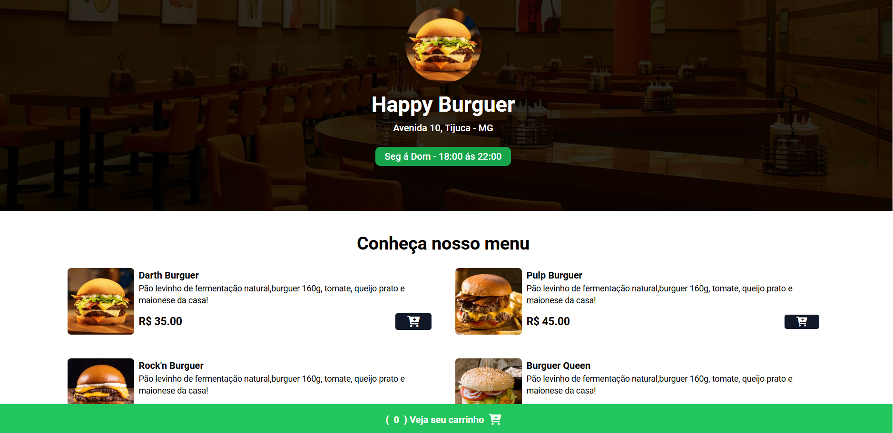

<h1 align="center">  Happy Burguer - a melhor hamburgueria dev ! </h1>

Happy Burguer - é um site de hamburgueria inteligente, que entrega uma experiência agradável para o cliente
 e eficiência nos pedidos para o restaurante!  

  <a href="#-tecnologias">Tecnologias</a>&nbsp;&nbsp;&nbsp;|&nbsp;&nbsp;&nbsp;
  <a href="#-projeto">Projeto</a>&nbsp;&nbsp;&nbsp;|&nbsp;&nbsp;&nbsp;

 

  

## 🚀 Tecnologias

Esse projeto foi desenvolvido com as seguintes tecnologias:

- HTML e Tailwindcss
- JavaScript
- Git e Github
- Nodejs

## 💻 Projeto

O Happy Burguer é um exemplo de site para restaurantes e afins.

- [Visite o projeto online](https://lorenaop.github.io/hamburgueria/)

